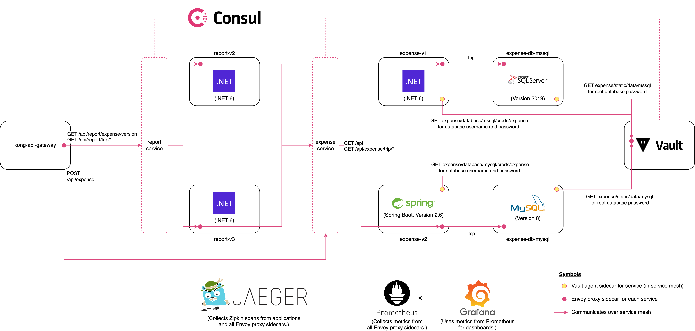

# Expense Report

A set of .NET Core and Java Spring Boot services that records expenses
and returns a report for a given trip identifier.

## What it does

Expense Report uses Consul for service mesh, application configuration,
and feature toggling capabilities.

For multiple frameworks, Consul Connect provides service mesh capabilities
that enable a consistent method of configuring:

* Service Discovery
* Network Policy (via Consul intentions)
* Load balancing
* Additional Tracing Metadata
* Circuit Breaking (AKA Outlier Detection)

## Expense Report Application

The report application connects to the expense application, which retrieves information
from a database. You'll find two versions of the expense application, one in .NET and one in Java.


Below are the most useful endpoints for the `expense` service:

- GET `/api/expense`: Get a list of expenses
- POST `/api/expense`: Create a new expense. See schema under `example/expense.json`.

Java defaults to `:8080` and .NET Core
defaults to `:5001`.

Below are the most useful endpoints for the `report` service:

- GET `/api/report/expense/version`: Gets the version of the expense application for debugging
- GET `/api/report/trip/${trip_id}`: Gets a list of expenses for a given trip.

`${trip_id}` denotes the trip identifer passed in the body of the expense item
created in the `POST` method to `expense`. Since the `report` application is
currently only available in .NET Core, it runs by default on port `:5002`.
## Kubernetes



### Prerequisites

- Kubernetes. The configurations use a cluster set up in GKE as per the `/terraform` directory.
You can use the Terraform to create a Kubernetes cluster for all of the applications.

- [Locust](https://locust.io/) to mimic user traffic.

- Consul 1.10+

- Vault 1.8+

- Terraform 1.0+. For creating cluster and configuring Vault.

### Setup

You can run `make k8s` to deploy all of the components you'll need to run in the cluster
to the `default` namespace.

```shell
$ make k8s
```

The order of operations __does matter__, especially because we're enabling tracing and metrics
in the cluster.

- Consul: by Helm chart, review `helm/consul.yaml` for values.

- Grafana: by Helm chart, review `helm/grafana.yaml` for values. __Not in service mesh.__
  It adds two dashboards.
  - Expense Report (custom application dashboard)
  - Kong (default dashboard for Kong metrics)

- Jaeger: for tracing, review `kubernetes/jaeger.yaml`. __Not in service mesh.__

- Ingress with Kong API Gateway: by Helm chart, review `helm/kong.yaml` for values.
  It installs two plugins.
  - Zipkin (for tracing)
  - Prometheus (for metrics)

- Vault: by Helm chart, review `helm/consul.yaml` for values.
  It has a configuration expressed in Terraform under `vault/` and adds the following.
  - Database root password for MSSQL as a static secret.
  - Database root password for MySQL as a static secret.
  - Database secrets engine for MSSQL username and password for expense application.
  - Database secrets engine for MySQL username and password for expense application.

- Microsoft SQL Server Database (MSSQL) 2019: for expense application. Table under `DemoExpenses`.

- MySQL Database: for expense application, version 2. Table under `DemoExpenses`.

- Expense Application: two versions. Uses a Consul [service splitter](https://www.consul.io/docs/connect/config-entries/service-splitter)
  to manage traffic between versions.
  - `joatmon08/expense:dotnet`: Uses Microsoft SQL Server with a .NET Core 2.2 application.
  - `joatmon08/expense:java-v2`: Uses MySQL with a Sprint Boot application.

- Report Application: two versions. Uses Consul [service router](https://www.consul.io/docs/connect/config-entries/service-router)
  to route traffic based on headers for debugging.
  - `joatmon08/report:dotnet-v2`: Does not include a field for total reimbursable expenses.
  - `joatmon08/report:dotnet-v3`: Does include a field for total reimbursable expenses.

### Cleanup

Run `make clean-k8s` to remove everything from the Kubernetes cluster.

```shell
$ make clean-k8s
```

## Docker-Compose

In addition to using Consul Connect, the `expense` microservice
demonstrates the use of [Spring Cloud Consul
Config](https://cloud.spring.io/spring-cloud-consul/reference/html/)
for retrieving application properties from Consul KV.

Finally, the `report` microservice uses
[consul-template](https://github.com/hashicorp/consul-template)
to feature toggle the addition of a "Number of Items" field for the
report.

### Prerequisites

* Docker
* docker-compose

### Startup

1. To start, bring up the Consul server, MySQL database, Microsoft SQL
   Server database, `consul-template`, Jaeger for tracing, and
   the expense services in .NET Core and Java.

   ```shell
   $ make all
   ```

   This will not only bring up the stack but add the application configuration
   for the `expense` service.

   

1. Open Jaeger on http://localhost:16686 and Consul on http://localhost:8500.

### Service Networking with Consul Connect

To try out:

* Service discovery
* Network policy
* Load balancing
* Additional tracing metadata

You can create the `report` service by running `make report-app`.

### Circuit Breaking

To try __circuit breaking__ (outlier detection in Envoy), note that it the
configuration requires an unsupported Consul escape hatch override. It cannot
have any service resolver or splitter configuration. To run it, issue
`make circuit-break`. Note that by running this command, it will delete
existing Consul L7 configuration and redeploy the `report` service.

You can run a test with `make circuit-break-test`.
This will stop the Microsoft SQL Server database and fail calls to the .NET Core
`expense` service. As a result, circuit breaker will trip in the `report`
service and route all traffic to the Java `expense` service.

## Feature Toggling with Consul KV & consul-template

To try __feature toggling__, you can trigger a toggle that enables
the number of expense items to print out in the `report` service. Issue
`make toggle-on` to enable and you will see a number of items listed.

```shell
> curl -s http://localhost:5002/api/report/trip/d7fd4bf6-aeb9-45a0-b671-85dfc4d095aa | jq
{
  "tripId": "d7fd4bf6-aeb9-45a0-b671-85dfc4d095aa",
  "expenses": [],
  "total": 0,
  "numberOfExpenses": 0
}
```

 Run `make toggle-off` to disable and remove the number of expense items.

```shell
 curl -s http://localhost:5002/api/report/trip/d7fd4bf6-aeb9-45a0-b671-85dfc4d095aa | jq
{
  "tripId": "d7fd4bf6-aeb9-45a0-b671-85dfc4d095aa",
  "expenses": [],
  "total": 0,
}
```

### Application Configuration with Consul KV

To try __application configuration storage__, you can go to the Consul
UI and examine the `configuration` path under "Key/Value". This uses
a file format to add the `application.properties` required for a Spring
Boot application.