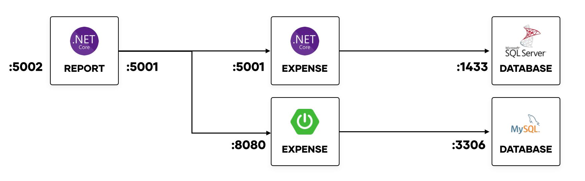
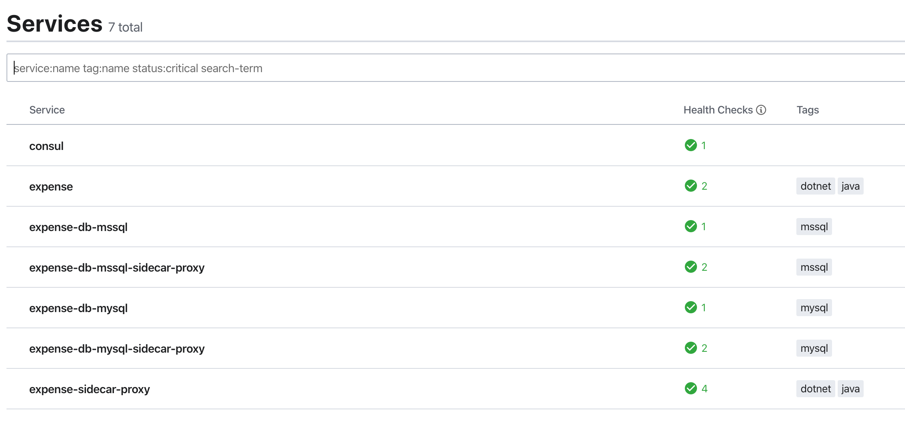

# Expense Report

A set of .NET Core and Java Spring Boot services that records expenses
and returns a report for a given trip identifier.



## What it does

Expense Report uses Consul for service mesh, application configuration,
and feature toggling capabilities.

For multiple frameworks, Consul Connect provides service mesh capabilities
that enable a consistent method of configuring:

* Service Discovery
* Network Policy (via Consul intentions)
* Load balancing
* Additional Tracing Metadata
* Circuit Breaking (AKA Outlier Detection)

In addition to using Consul Connect, the `expense` microservice
demonstrates the use of [Spring Cloud Consul
Config](https://cloud.spring.io/spring-cloud-consul/reference/html/)
for retrieving application properties from Consul KV.

Finally, the `report` microservice uses
[consul-template](https://github.com/hashicorp/consul-template)
to feature toggle the addition of a "Number of Items" field for the
report.

## APIs

Below are the most useful endpoints for the `expense` service:

* `curl -X GET 'http://localhost:${port}/api/expense'`
* `curl -X POST 'http://localhost:${port}/api/expense' -H 'Content-Type:application/json' -d @example/expense.json`

`${port}` will depend on the framework. Java defaults to `:8080` and .NET Core
defaults to `:5001`.

Below are the most useful endpoints for the `report` service:

* `curl -X GET 'http://localhost:5002/api/report/trip/${trip_id}'`

`${trip_id}` denotes the trip identifer passed in the body of the expense item
created in the `POST` method to `expense`. Since the `report` application is
currently only available in .NET Core, it runs by default on port `:5002`.

## Prerequisites

* Docker
* docker-compose

## Startup

1. To start, bring up the Consul server, MySQL database, Microsoft SQL
   Server database, `consul-template`, Jaeger for tracing, and
   the expense services in .NET Core and Java.

   ```shell
   > make all
   ```
  
   This will not only bring up the stack but add the application configuration
   for the `expense` service.

   

1. Open Jaeger on http://localhost:16686 and Consul on http://localhost:8500.

## Service Networking with Consul Connect

To try out:

* Service discovery
* Network policy
* Load balancing
* Additional tracing metadata

You can create the `report` service by running `make report-app`.

### Circuit Breaking

To try __circuit breaking__ (outlier detection in Envoy), note that it the
configuration requires an unsupported Consul escape hatch override. It cannot
have any service resolver or splitter configuration. To run it, issue 
`make circuit-break`. Note that by running this command, it will delete
existing Consul L7 configuration and redeploy the `report` service.

You can run a test with `make circuit-break-test`.
This will stop the Microsoft SQL Server database and fail calls to the .NET Core
`expense` service. As a result, circuit breaker will trip in the `report`
service and route all traffic to the Java `expense` service.

## Feature Toggling with Consul KV & consul-template

To try __feature toggling__, you can trigger a toggle that enables
the number of expense items to print out in the `report` service. Issue
`make toggle-on` to enable and you will see a number of items listed.

```shell
> curl -s http://localhost:5002/api/report/trip/d7fd4bf6-aeb9-45a0-b671-85dfc4d095aa | jq                                                                                                        
{
  "tripId": "d7fd4bf6-aeb9-45a0-b671-85dfc4d095aa",
  "expenses": [],
  "total": 0,
  "numberOfExpenses": 0
}
```

 Run `make toggle-off` to disable and remove the number of expense items.

```shell
 curl -s http://localhost:5002/api/report/trip/d7fd4bf6-aeb9-45a0-b671-85dfc4d095aa | jq                                                                                                        
{
  "tripId": "d7fd4bf6-aeb9-45a0-b671-85dfc4d095aa",
  "expenses": [],
  "total": 0,
}
```

## Application Configuration with Consul KV

To try __application configuration storage__, you can go to the Consul
UI and examine the `configuration` path under "Key/Value". This uses
a file format to add the `application.properties` required for a Spring
Boot application.
